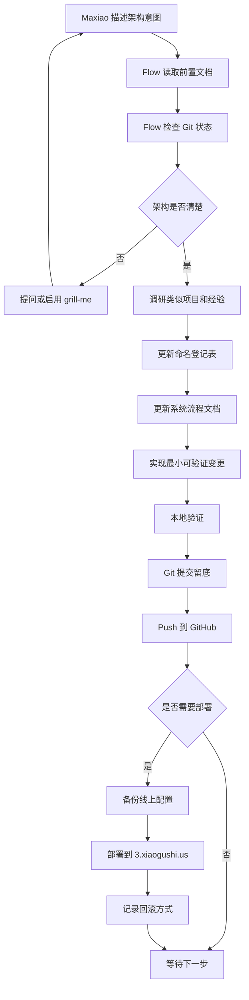
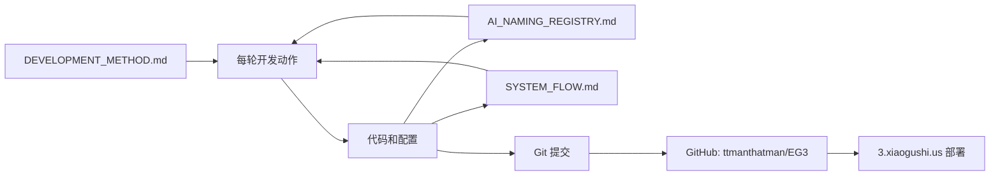
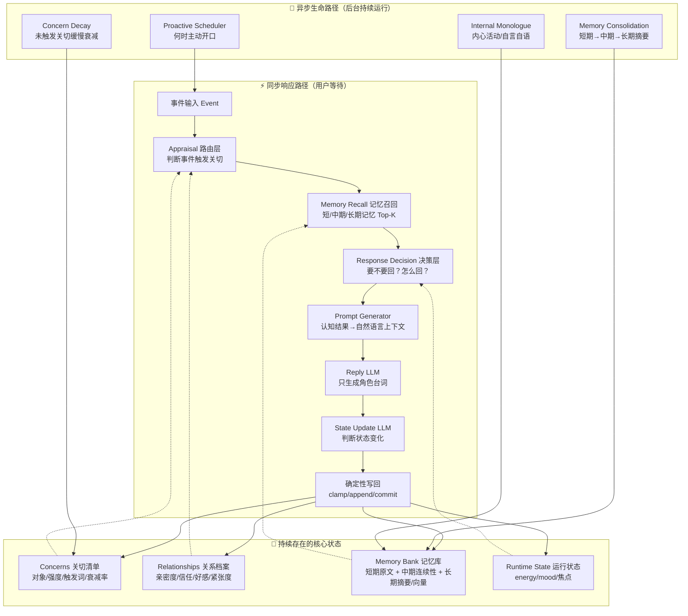
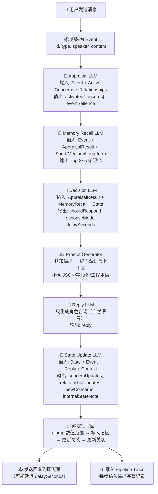
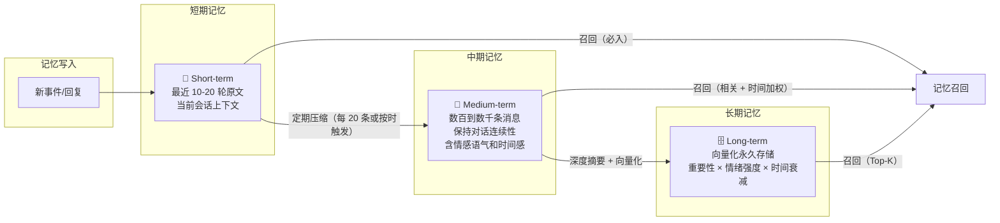
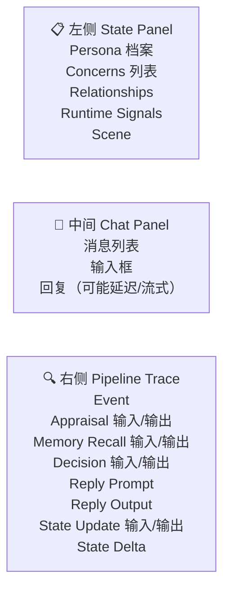

# System Flow

本文档说明系统如何运作、数据如何流动、模块之间如何调用。它既给 Maxiao 看，也给 AI 后续开发使用。

## 当前阶段

**Phase 0：文档和基础设施搭建**

- 已建立开发方法（DEVELOPMENT_METHOD.md）
- 已完成 MVP 前调研（RESEARCH_NOTES.md）
- 已建立 AI 命名登记表（AI_NAMING_REGISTRY.md）
- 已连接 GitHub 仓库（ttmanthatman/EG3）
- 系统流程文档（本文档）

## 总体开发工作流

## 文档和代码关系

## 虚拟人认知架构全景（目标态）

## 同步响应路径详图（一条消息的旅程）

## 三层记忆架构（Nomi AI 启发）

## 当前 MVP UI 结构

## 当前模块状态

| 模块 | 状态 | 说明 |
| --- | --- | --- |
| 开发方法 | ✅ initialized | `docs/DEVELOPMENT_METHOD.md` |
| 命名登记 | ✅ initialized | `docs/AI_NAMING_REGISTRY.md` |
| 系统流程 | ✅ initialized | 本文档 |
| 调研笔记 | ✅ initialized | `docs/RESEARCH_NOTES.md` |
| 错误勘验 | ⏳ pending | 尚未发生需要勘验的错误 |
| Git 仓库 | ✅ initialized | 已连接 `ttmanthatman/EG3` |
| Phase 1: 静态角色 + 基础对话 | ⏳ pending | 待实现 |
| Phase 2: Concern 系统 | ⏳ pending | 待实现 |
| Phase 3: Relationship 系统 | ⏳ pending | 待实现 |
| Phase 4: 长期记忆召回 | ⏳ pending | 待实现 |
| Phase 5: 响应决策层 | ⏳ pending | 待实现 |
| Phase 6: 异步后台 | ⏳ pending | 待实现 |
| VPS 部署 | ⏳ pending | 待 Code + Docker配置完成后部署 |
